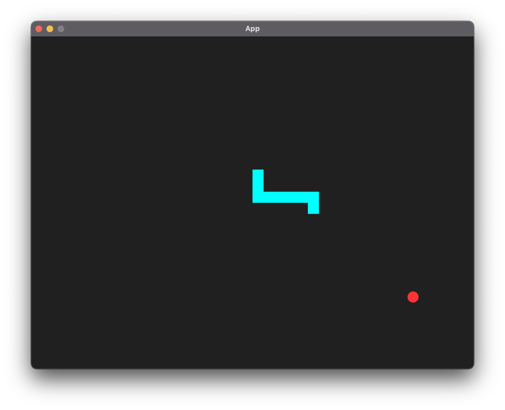
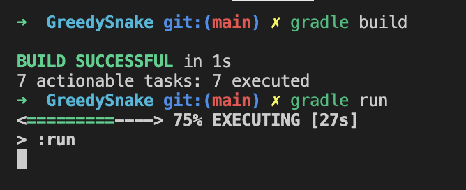

# README


## Intro

This is a Java project built using Gradle.

In order to run this project, you need to have ==Gradle== and ==Java 8== installed and used.

__*It’s highly recommended to use ==sdkman== to install Gradle and Java 8 and switch between different Java versions.*__




## User Guide

1. Git clone this repo:

```bash
git clone git@github.com:DahaoTang/GreedySnake.git
```

2. Go to the root folder of the repo, then run:

```bash
gradle build
```

3. Run the project:

```bash
gradle run
```




## Game Instruction

Use the arrow keys or “W”, “A”, “S”, “D” to change the direction the snake will move in.

Use the space key to pause the snake. To continue, change the direction of the snake according to the instruction mentioned above.

If the snake hit itself or any of the walls, the game is over. 

Press “R” to restart the game at anytime.